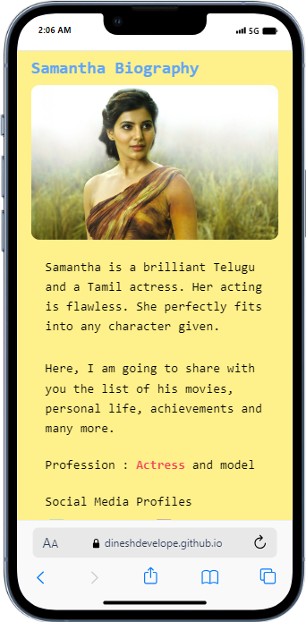

# Project Title

Samantha Biography Page

## Table of Contents

- [Samantha Biography](#project-title)
- [Description](#description)
- [Demo](#demo)
- [Internship](#internship)
- [Technologies Used](#technologies-used)
- [Installation](#installation)

## Description

Here, I am going to share with you the list of samantha movies, personal life, achievements and many more.

## Demo

### Home page



[Live preview](https://dineshdevelope.github.io/Samantha-Biography-Page/)

## Internship

This internship is provided by [CyberDude Networks Pvt. Ltd.](https://youtube.com/cyberdudenetworks) as part of the 6-Month Free Internship program, a skill development initiative organized to enhance participants' skills. Mentoring was provided by [Mr. Anbuselvan Rocky](https://instagram.com/anbuselvanrocky). For more information, [you can contact CyberDude Networks here](https://cyberdudenetworks.com).

## Technologies Used

- HTML
- Tailwind CSS

## Installation

<h3>Clone the Repository:</h3>

```
git clone https://github.com/dineshdevelope/Samantha-Biography-Page.git
```

Navigate to the project

```
cd php-course-landing-page
```

Install the Dependencies

```
npm install
```

Run the Project

```
npm run dev
```
